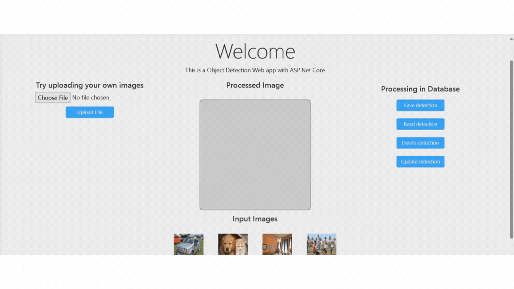

# Object Detection Based on ASP.net Core Framework
## This is A object detection web application that is connected to SQL server.

## More about the model [here!](https://github.com/dotnet/machinelearning-samples/blob/main/samples/csharp/end-to-end-apps/ObjectDetection-Onnx/README.md)